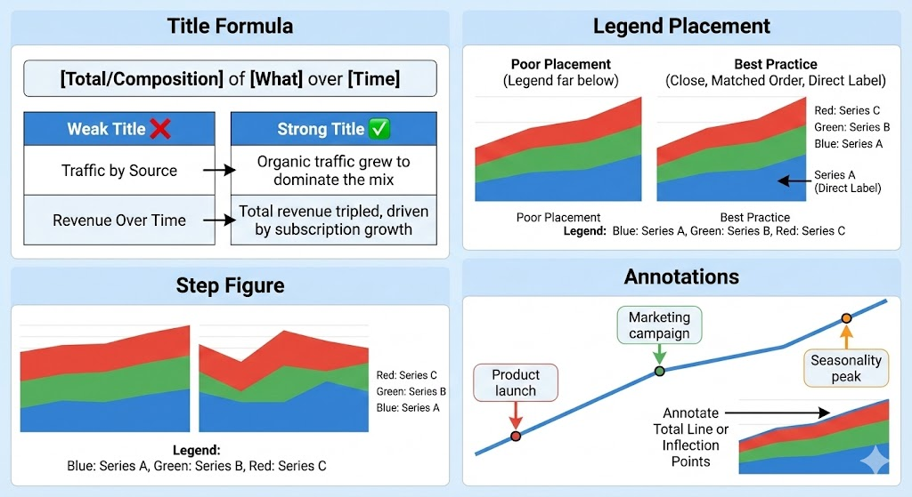

# Area Chart: The Complete Guide

**← [Back to Graphs &amp; Dashboard Design](../intro-to-graphs.md)**

The area chart adds visual weight to trends, when you want to emphasize volume or cumulative totals over time, filling the space below the line creates impact.

---

## History & Origin

### Playfair's Filled Lines (1786)

William Playfair introduced area charts in his Commercial and Political Atlas (1786), using filled regions to show England's trade balance. By filling the space between the line and axis, he emphasized the **magnitude** of values, not just the trend.

### Why Area Over Line?

A line chart shows direction. An area chart shows direction AND volume. The filled space creates visual weight, making growth feel substantial and decline feel like loss.

---

## When to Use an Area Chart

### Perfect For:

| Question Type                   | Example                                       |
| ------------------------------- | --------------------------------------------- |
| **Volume over time**      | How much total traffic do we get?             |
| **Cumulative totals**     | How has total revenue accumulated?            |
| **Composition over time** | How has traffic source mix changed? (stacked) |
| **Emphasizing magnitude** | The scale of growth or decline                |

### Not Ideal For:

- Comparing multiple independent series (lines overlap/hide each other)
- Precise value reading (filled areas are less precise than [line charts](./line-chart.md))
- Non-time data (area implies continuity)
- Many overlapping series (becomes unreadable)

---

## Area Chart Variations

| Type                        | Use Case                | Key Feature                       |
| --------------------------- | ----------------------- | --------------------------------- |
| **Basic area**        | Single metric over time | One filled region                 |
| **Stacked area**      | Composition of total    | Multiple filled regions stacked   |
| **100% stacked area** | Proportion changes      | Always sums to 100%               |
| **Overlapping area**  | Comparing magnitudes    | Series overlap (use transparency) |
| **Stream graph**      | Fluid composition       | Centered, flowing design          |

---

## Stacked Area: Showing Composition

### When Stacked Works

Stacked area charts excel at showing:

- How a total is composed of parts
- How composition changes over time
- The growth of all parts together

**Example**: Website traffic by source (Direct, Organic, Paid, Social)

### The Stacking Problem

The bottom series has a clear baseline (zero). Every series above it has a **distorted** baseline because it sits on top of another wiggly line.

**Result**: Only the bottom series and the total are accurately readable. Middle series are difficult to compare.

**Solutions**:

- Put the most important series at the bottom
- Use 100% stacked when proportions matter more than absolutes
- Consider small multiples (separate area for each series)

---

## Design Principles:

### 1. Baseline Must Be Zero

Area charts encode value as **space filled**. If the chart doesn't start at zero, the filled area misrepresents the data.

**Never truncate the y-axis on an area chart.**

### 2. Limit Series Count

| Number of Series | Recommendation                          |
| ---------------- | --------------------------------------- |
| 1                | clean, clear                            |
| 2-3              | Stacked works well                      |
| 4-5              | Getting crowded; ensure colors distinct |
| 6+               | Too many, consider alternative graphs   |

### 3. Color and Transparency

**For overlapping areas**:

- Use 30-50% transparency
- Darker colors for more important series
- Avoid similar colors for adjacent series

**For stacked areas**:

- Distinct colors for each series
- Consider sequential palette (light to dark) for ordered categories
- Avoid vibrant colors for all series, it's overwhelming

### 4. Order in Stacked Charts

The order of stacking affects readability:

| Strategy                           | When to Use                            |
| ---------------------------------- | -------------------------------------- |
| **Largest at bottom**        | When total volume is the story         |
| **Most important at bottom** | When one series needs accurate reading |
| **Most volatile at top**     | When stability at bottom helps reading |
| **Logical order**            | When categories have inherent sequence |

### 5. Gridlines and Axis

- Horizontal gridlines help read values
- Don't overdo it — 3-5 gridlines usually enough
- Consider removing gridlines for stacked areas (precision isn't the point)

---

## Common Issues and How to Fix Them

| Issue                                      | Problem                                                                                                                                                        | Fix                                                                                                                                                                                      |
| ------------------------------------------ | -------------------------------------------------------------------------------------------------------------------------------------------------------------- | ---------------------------------------------------------------------------------------------------------------------------------------------------------------------------------------- |
| **Hidden Data in Overlapping Areas** | With multiple overlapping series, areas hide each other. Example: Three products' revenue over time, the one on top hides the others                           | Use transparency · Use stacked area instead · Use multiple line charts · Use small multiples (one area per series)                                                                    |
| **Y-Axis Not Starting at Zero**      | Truncated axis makes changes look larger than they are. The filled space is visually interpreted as volume, a truncated axis lies about that volume           | Always start at zero. If you need to show small changes, consider a line chart instead                                                                                                   |
| **Too Many Series (Spaghetti)**      | 8+ stacked series become impossible to distinguish                                                                                                             | Group into 3-4 main categories + "Other" · Use 100% stacked if proportions matter · Small multiples · Interactive filtering                                                           |
| **Misleading Stacked Areas**         | Middle series appear to grow/shrink due to baseline shifts. Example: Series B looks like it's growing, but it's actually flat. Series A below it is shrinking | Be aware of this limitation · Add annotations to clarify · Consider showing each series separately · Use 100% stacked if proportions are the story                                    |
| **Stream Graphs Without Purpose**    | Stream graphs (centered stacked areas) look impressive but are even harder to read than stacked areas                                                          | Use when aesthetics matter more than precision, showing general flow, or audience doesn't need exact values. Avoid for business dashboards requiring decisions or when precision matters |
| **Confusing Area with Line**         | Users try to read values from the top of the area as if it were a line                                                                                         | Make sure the area touches zero · Add gridlines at meaningful intervals · Consider adding data labels at key points                                                                    |

---

## Labeling Best Practices

### Title Formula

**Pattern**: [Total/Composition] of [What] over [Time]

| Weak Title          | Strong Title                                           |
| ------------------- | ------------------------------------------------------ |
| "Traffic by Source" | "Organic traffic grew to dominate the mix"             |
| "Revenue Over Time" | "Total revenue tripled, driven by subscription growth" |

### Legend Placement

- Place legend close to the chart (not far below)
- Order legend to match stack order
- Consider labeling series directly on the chart

### Annotations

Mark significant events:

- "Product launch"
- "Marketing campaign"
- "Seasonality peak"

For stacked areas, annotate the total line or specific inflection points.

---

## When to Use Line vs. Area

| Choose Area When                | Choose Line When               |
| ------------------------------- | ------------------------------ |
| Volume/magnitude is the message | Trend/direction is the message |
| Single series or clear stacking | Multiple comparable series     |
| Cumulative totals matter        | Precise values matter          |
| You want visual weight          | You want clean precision       |

**General rule**: Area charts emphasize "how much." [Line charts](./line-chart.md) emphasize "in which direction."

---

## Quick Checklist

Before publishing an area chart:

- [ ] Y-axis starts at zero
- [ ] Maximum 4-5 series (fewer is better)
- [ ] Series ordered intentionally
- [ ] Colors distinct and meaningful
- [ ] Transparency used if overlapping
- [ ] Legend matches stack order
- [ ] Key events annotated
- [ ] Title communicates the insight
- [ ] Stacking isn't hiding important patterns

**Final question**: Would a line chart be clearer? Area adds emphasis but sacrifices precision.

---

## Summary

The area chart emphasizes volume and composition:

- Use it when "how much" matters as much as "which direction"
- Stacked areas show composition but distort middle series
- Always start at zero, the filled space represents magnitude

When you want visual weight behind your trend, choose area. When you need precise comparison, choose [line chart](./line-chart.md).

---

## See Also

- **[Line Chart](./line-chart.md)** — For precise trend tracking without visual emphasis
- **[Bar Chart](./bar-chart.md)** — For comparing volumes at a single point in time
- **[Histogram](./histogram.md)** — For understanding the distribution of your data
- **[Stacked Area Charts](./area-chart.md#stacked-area-showing-composition)** — Understanding the baseline problem

**Related Concepts**:

- [Dashboard Design Principles](../intro-to-graphs.md#part-7-dashboard-design-principles)
- [What is a Dashboard](../intro-to-graphs.md#part-3-what-is-a-dashboard)
- [Common Design Mistakes](../intro-to-graphs.md#part-5-common-dashboard-design-mistakes)
