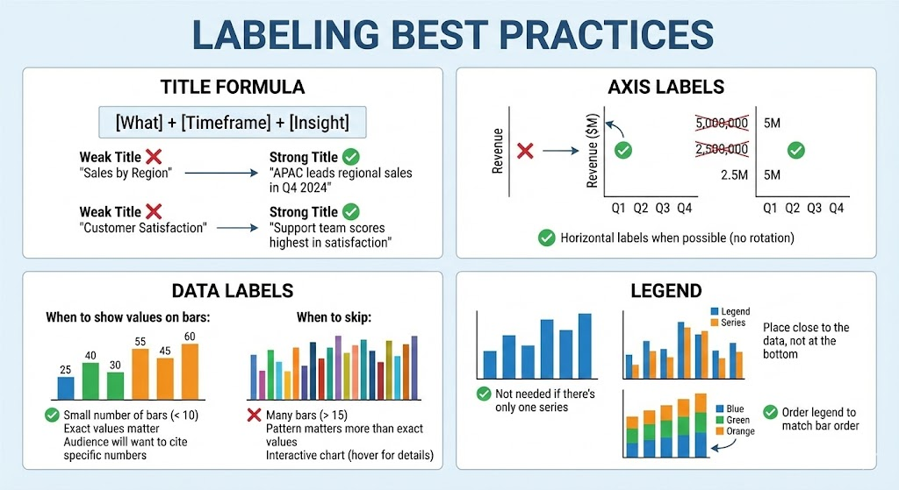

# Bar Chart: The Complete Guide

**← [Back to Graphs &amp; Dashboard Design](../intro-to-graphs.md)**

The bar chart is the workhorse of data visualization — simple, versatile, and universally understood.

<!-- Image Definitions -->

---

## History & Origin

### The Accidental Invention (1786)

William Playfair invented the bar chart almost by accident. He was trying to visualize Scotland's trade data but had incomplete records — too many gaps to create a time series.

His solution: instead of connecting points over time, he drew discrete bars to compare different trade partners. The bar chart was born from **constraint, not design**.

### Why It Works

The bar chart leverages one of our strongest visual abilities: **comparing lengths**. Humans are remarkably accurate at judging relative lengths — far better than comparing areas ([pie charts](./pie-chart.md)) or angles ([scatter plots](./scatter-plot.md)).

---

## When to Use a Bar Chart

### Perfect For:

| Question Type                           | Example                            |
| --------------------------------------- | ---------------------------------- |
| **Comparison across categories**  | Which product sells most?          |
| **Ranking**                       | Top 10 features by usage           |
| **Single point-in-time snapshot** | Revenue by region this quarter     |
| **Discrete categories**           | Satisfaction ratings by department |

### Not Ideal For:

- Change over time (use [line chart](./line-chart.md))
- Part-to-whole relationships (consider [pie chart](./pie-chart.md) or stacked bar)
- More than 15-20 categories (becomes overwhelming)
- Continuous data (use histogram)

---

## Bar Chart Variations

### Horizontal vs. Vertical

| Orientation          | When to Use                                     |
| -------------------- | ----------------------------------------------- |
| **Vertical**   | Few categories (5-7); category labels are short |
| **Horizontal** | Many categories; long category labels; ranking  |

**Rule of thumb**: If labels need to be rotated 45°, switch to horizontal.

![Horizontal vs Vertical Bar Charts][horizontal-vs-vertical]

### Common Variations

| Type                       | Use Case               | Example                                  |
| -------------------------- | ---------------------- | ---------------------------------------- |
| **Grouped Bar**      | Compare sub-categories | Revenue by region, split by product line |
| **Stacked Bar**      | Show composition       | Total revenue, broken down by source     |
| **100% Stacked Bar** | Compare proportions    | Market share by year                     |
| **Diverging Bar**    | Show positive/negative | Profit/loss by department                |

![Bar Chart Variations][bar-variations]

---

## Design Principles: What Makes a Beautiful Bar Chart

### 1. Bars Must Start at Zero

**The Cardinal Rule**: A bar's length represents its value. If you truncate the axis, you distort the truth.

**Bad**: Y-axis starts at 50, making small differences look huge
**Good**: Y-axis starts at 0, showing accurate proportions

### 2. Order Matters

| Ordering Strategy               | When to Use                                                 |
| ------------------------------- | ----------------------------------------------------------- |
| **By value (descending)** | When showing rankings or "top N"                            |
| **Alphabetically**        | When users need to find specific categories                 |
| **Logically**             | When categories have inherent order (Jan-Dec, Low-Med-High) |

**Default**: Sort by value unless there's a good reason not to.

![Horizontal Bar Example - Sorted by Value][horizontal-bar]

### 3. Spacing and Proportions

| Guideline                  | Recommendation                                   |
| -------------------------- | ------------------------------------------------ |
| **Bar-to-gap ratio** | Bars 1.5-2x the width of gaps                    |
| **Bar width**        | Wider than gaps between bars                     |
| **Balance**          | Too thin = hard to read; too thick = feels heavy |

### 4. Color Usage

| Approach                  | When to Use                                          |
| ------------------------- | ---------------------------------------------------- |
| **Single color**    | Simple comparisons                                   |
| **Highlight color** | Call attention to one bar                            |
| **Semantic color**  | Meaningful categories (e.g., red=loss, green=profit) |
| **Avoid**           | Rainbow colors, gradients, 3D effects                |

### 5. Labels and Annotations

| Element                   | Best Practice                                                                   |
| ------------------------- | ------------------------------------------------------------------------------- |
| **Title**           | State the insight, not just the topic. "Sales increased 40% in Q4" > "Q4 Sales" |
| **Axis labels**     | Clear units; avoid abbreviations                                                |
| **Data labels**     | On the bars (inside or outside) for small datasets; skip for large ones         |
| **Reference lines** | Show targets, averages, or benchmarks                                           |

---

## Common Issues and How to Fix Them

| Issue                               | Problem                                                                                                                                                                              | Fix                                                                                                                                |
| ----------------------------------- | ------------------------------------------------------------------------------------------------------------------------------------------------------------------------------------ | ---------------------------------------------------------------------------------------------------------------------------------- |
| **Bars Not Starting at Zero** | Truncated y-axis exaggerates differences. Example: Company A (98%) vs B (95%) — with axis starting at 90%, A looks twice as large as B                                              | Always start at zero. If differences are truly small but meaningful, state that in the annotation instead of distorting the visual |
| **Too Many Bars**             | 30+ bars creates visual noise                                                                                                                                                        | Show top 10 + "Other" · Group into logical categories · Use a table instead · Add filtering/interactivity                       |
| **3D Effects**                | 3D makes it impossible to accurately read values. Which edge do you read from?                                                                                                       | Remove 3D immediately. It adds nothing but confusion                                                                               |
| **Inconsistent Bar Widths**   | Some tools vary bar width based on data, which misleads                                                                                                                              | All bars should be identical width. Length is the only variable                                                                    |
| **Poor Ordering**             | Bars in random or alphabetical order when ranking matters                                                                                                                            | If the question is "which is biggest?", sort by value                                                                              |
| **Dual Y-Axes**               | Two different scales on left and right axes: Users can't compare bars accurately · The relationship shown depends entirely on scale choices · Easy to manipulate to tell any story | Use two separate charts, or normalize to percentages                                                                               |

---

## Labeling Best Practices

### Title Formula

**Pattern**: [What] + [Timeframe] + [Insight]

| Weak Title              | Strong Title                                  |
| ----------------------- | --------------------------------------------- |
| "Sales by Region"       | "APAC leads regional sales in Q4 2024"        |
| "Customer Satisfaction" | "Support team scores highest in satisfaction" |

### Axis Labels

| Do                         | Example                           |
| -------------------------- | --------------------------------- |
| Include units              | "Revenue ($M)" not just "Revenue" |
| Use human-readable numbers | "2.5M" not "2,500,000"            |
| Keep labels horizontal     | Avoid rotation when possible      |

### Data Labels

| Show Values On Bars                         | Skip Values                            |
| ------------------------------------------- | -------------------------------------- |
| Small number of bars (< 10)                 | Many bars (> 15)                       |
| Exact values matter                         | Pattern matters more than exact values |
| Audience will want to cite specific numbers | Interactive chart (hover for details)  |

### Legend

- Not needed if there's only one series
- Place close to the data, not at the bottom
- Order legend to match bar order

---

## Quick Checklist

Before publishing a bar chart:

- [ ] Y-axis starts at zero
- [ ] Bars are ordered meaningfully
- [ ] Bar widths are consistent
- [ ] No 3D effects or gradients
- [ ] Colors have purpose (not just decoration)
- [ ] Title states the insight
- [ ] Axis labels include units
- [ ] No more than 15-20 bars
- [ ] Reference lines for context (if applicable)

---

## Summary

The bar chart's simplicity is its power. Respect its constraints:

- Length represents value — never truncate
- Order represents priority — sort intentionally
- Simplicity represents clarity — remove decoration

When in doubt, make it simpler.

---

## See Also

- **[Line Chart](./line-chart.md)** — For showing change over time instead of comparisons
- **[Pie Chart](./pie-chart.md)** — When comparing part-to-whole relationships
- **[Histogram](./histogram.md)** — For showing distributions of continuous data
- **[Stacked Bar Chart](./stacked-bar.md)** — When to use stacked vs grouped bars
- **[Grouped Bar Chart](./grouped-bar.md)** — Comparing sub-categories side-by-side

**Related Concepts**:

- [Visual Hierarchy in Dashboards](../intro-to-graphs.md#part-7-dashboard-design-principles)
- [Dashboard Design Mistakes](../intro-to-graphs.md#part-5-common-dashboard-design-mistakes)
- [Graph Types Reference](../intro-to-graphs.md#part-6-graph-types-reference)

[horizontal-bar]: image/bar-chart/1768737601473.png
[horizontal-vs-vertical]: image/bar-chart/1768737646667.png
[bar-variations]: image/bar-chart/1768738023190.png
