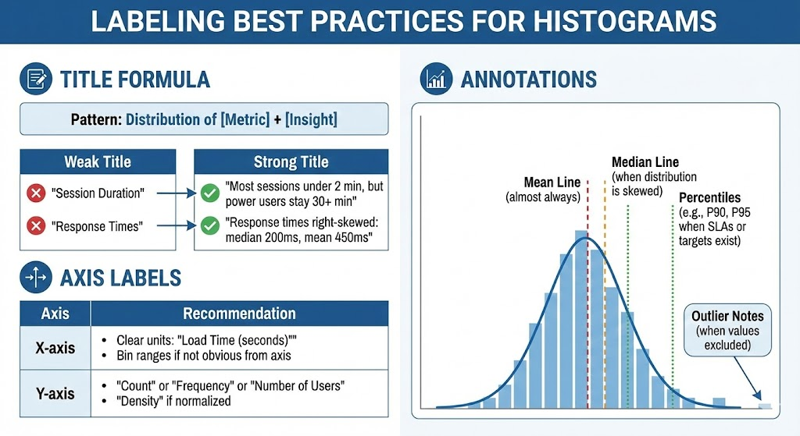

# Histogram: The Complete Guide

**← [Back to Graphs &amp; Dashboard Design](../intro-to-graphs.md)**

The histogram answers the question every product person should ask: "How is this distributed?" It shows the shape of your data — where values cluster, how spread out they are, and whether there are unusual patterns.

---

## History & Origin

### Karl Pearson (1895)

The histogram was introduced by statistician Karl Pearson in 1895. Unlike Playfair's commercial visualizations, the histogram came from **statistical science,** designed to show frequency distributions.

### Why It's Essential

Most metrics aren't just a single number. "Average session time is 5 minutes" hides crucial information:

- Are most users around 5 minutes? (normal distribution)
- Are half at 1 minute and half at 9 minutes? (bimodal)
- Are most at 30 seconds with a few at 30 minutes? (skewed)

The histogram reveals this hidden structure.

---

## When to Use a Histogram

### Perfect For:

| Question Type                     | Example                                    |
| --------------------------------- | ------------------------------------------ |
| **Distribution shape**      | Are response times normally distributed?   |
| **Central tendency**        | Where do most values fall?                 |
| **Spread/variability**      | How much do values vary?                   |
| **Outliers**                | Are there unusual extreme values?          |
| **Comparing distributions** | Do free vs. paid users behave differently? |

### Not Ideal For:

- Comparing categories (use [bar chart](./bar-chart.md))
- Showing trends over time (use [line chart](./line-chart.md))
- Small datasets (< 30 observations)
- Categorical data (use [bar chart](./bar-chart.md))

---

## Histogram vs. Bar Chart: The Critical Difference

| Feature            | Histogram          | [Bar Chart](./bar-chart.md) |
| ------------------ | ------------------ | ------------------------ |
| **X-axis**   | Continuous range   | Discrete categories      |
| **Bars**     | Touch each other   | Have gaps                |
| **Y-axis**   | Frequency/count    | Any measure              |
| **Order**    | Fixed (numerical)  | Flexible                 |
| **Question** | "How distributed?" | "How compare?"           |

**The touching bars matter**: They signal that the x-axis is continuous, adjacent bars represent adjacent ranges. Learn more in the [Bar Chart guide](./bar-chart.md).

---

## Understanding Distribution Shapes

### Common Patterns

| Shape                         | What It Means                           | Example                 |
| ----------------------------- | --------------------------------------- | ----------------------- |
| **Normal (bell curve)** | Values cluster around mean, symmetric   | Human heights           |
| **Right-skewed**        | Long tail to the right, most values low | Income, page load times |
| **Left-skewed**         | Long tail to the left, most values high | Age at retirement       |
| **Bimodal**             | Two peaks of two distinct groups        | Mixed user segments     |
| **Uniform**             | Roughly equal across range              | Random numbers          |

### Why Shape Matters for Product

| Shape                  | Implication                                | Action                         |
| ---------------------- | ------------------------------------------ | ------------------------------ |
| **Normal**       | Average is representative                  | Report averages confidently    |
| **Right-skewed** | Average is misleading (pulled by outliers) | Use median instead             |
| **Bimodal**      | Two user types exist                       | Segment and analyze separately |
| **Uniform**      | No dominant pattern                        | Look for missing segmentation  |

---

## Design Principles

### 1. Choosing Bin Width

**The most important decision in histogram design.**

| Too Few Bins                 | Too Many Bins                 |
| ---------------------------- | ----------------------------- |
| Hides important patterns     | Creates noise                 |
| Over-simplified              | Hard to see overall shape     |
| "Looks normal when it's not" | "Every value looks different" |

**Guidelines**:

- Start with square root of n (√n bins)
- Sturges' rule: 1 + 3.322 × log(n) bins
- Adjust visually  does the shape make sense?
- Try multiple bin widths to check robustness

### 2. Round Bin Edges

Make bin edges meaningful:

- "0-10, 10-20, 20-30" ✓
- "0-8.7, 8.7-17.4, 17.4-26.1" ✗

Round numbers help readers understand and remember.

### 3. Axis Choices

**X-axis**:

- Label bin ranges clearly
- Include units: "Response Time (seconds)"
- Consider log scale for highly skewed data

**Y-axis**:

- Usually frequency (count)
- Sometimes density (for comparing different sample sizes)
- Start at zero

### 4. Color

- **Single color** for basic distribution
- **Highlight color** to call out specific bins
- **Two colors** for comparing distributions (overlapping histograms)
- Transparency needed when overlapping

### 5. Reference Lines

Add vertical lines to show:

- Mean (solid line)
- Median (dashed line)
- Targets or thresholds
- Percentiles (25th, 75th)

---

## Common Issues and How to Fix Them

| Issue                                    | Problem                                                                                                                                                                           | Fix                                                                                                                                                                                   |
| ---------------------------------------- | --------------------------------------------------------------------------------------------------------------------------------------------------------------------------------- | ------------------------------------------------------------------------------------------------------------------------------------------------------------------------------------- |
| **Wrong Bin Width**                | Bin width hides the true distribution. Example: Response times with bins of 10 seconds hide that most are under 2 seconds                                                         | Experiment with different bin widths · Bins should reveal, not hide · Use automated methods as starting point, then adjust                                                          |
| **Confusing with Bar Charts**      | Gaps between bars imply categories, not continuous data                                                                                                                           | Bars must touch in histograms · Remove gaps · If your data is categorical, use a bar chart instead                                                                                  |
| **Non-Zero Y-Axis**                | Y-axis starts above zero, exaggerating differences                                                                                                                                | Always start y-axis at zero. The height represents count/frequency truncating distorts this                                                                                           |
| **Too Few Data Points**            | Histogram with 15 observations — not enough to show distribution                                                                                                                 | Need at least 30 observations for meaningful histogram · For smaller samples, use dot plots or strip plots · Or just list the values                                                |
| **Ignoring Outliers**              | A few extreme values create empty bins and compress the main distribution. Example: Response times mostly 1-5 seconds, but a few at 300 seconds — chart shows mostly empty space | Consider separate handling for outliers · Note outliers separately: "3 values > 60s not shown" · Use log scale for highly skewed data · Set reasonable axis limits with annotation |
| **Comparing Distributions Poorly** | Two histograms with different bin widths or scales — impossible to compare                                                                                                       | Use identical bin widths · Use identical y-axis scales · Consider overlapping histograms with transparency · Or use side-by-side with matched scales                               |

---

## Labeling Best Practices

### Title Formula

**Pattern**: Distribution of [Metric] + [Insight]

| Weak Title         | Strong Title                                              |
| ------------------ | --------------------------------------------------------- |
| "Session Duration" | "Most sessions under 2 min, but power users stay 30+ min" |
| "Response Times"   | "Response times right-skewed: median 200ms, mean 450ms"   |

### Axis Labels

| Axis             | Recommendation                                                            |
| ---------------- | ------------------------------------------------------------------------- |
| **X-axis** | Clear units: "Load Time (seconds)" · Bin ranges if not obvious from axis |
| **Y-axis** | "Count" or "Frequency" or "Number of Users" · "Density" if normalized    |

### Annotations

Use mean line (almost always), median line (when distribution is skewed), percentiles (when SLAs or targets exist), outlier notes (when values excluded).

---

## Comparing Distributions

### Overlapping Histograms

When comparing two groups:

- Use distinct colors with ~50% transparency
- Same bin width for both
- Same y-axis scale
- Clear legend

**Limitation**: Gets messy with 3+ groups

### Side-by-Side Histograms

- Same scale on both axes
- Same bin widths
- Labeled clearly
- Good for 2-4 groups

### Alternatives for Multiple Groups

| Method                    | Best For                              |
| ------------------------- | ------------------------------------- |
| **Box plots**       | Comparing 5+ distributions quickly    |
| **Violin plots**    | Showing shape across many groups      |
| **Ridge plots**     | Many distributions, emphasizing shape |
| **Small multiples** | Detailed view of each                 |

---

## Quick Checklist

Before publishing a histogram:

- [ ] Bars touch (no gaps)
- [ ] Appropriate bin width (not too few, not too many)
- [ ] Y-axis starts at zero
- [ ] Both axes labeled with units
- [ ] Mean and/or median marked
- [ ] Outliers handled transparently
- [ ] Title describes the distribution pattern
- [ ] At least 30 data points
- [ ] If comparing, same bin width and scale

---

## Summary

The histogram reveals what averages hide:

- It shows the **shape** of your data
- Shape tells you whether average is meaningful
- Bimodal shapes suggest hidden segments

Every time you report an average, ask: "What does the distribution look like?" If you don't know, you don't really understand your data.

---

## See Also

- **[Bar Chart](./bar-chart.md)** — Don't confuse this with bar chart (touching vs. gaps)
- **[Line Chart](./line-chart.md)** — For tracking how a distribution shifts over time
- **[Scatter Plot](./scatter-plot.md)** — For understanding relationships between two distributions
- **[Distribution Shapes](../glossary.md#distribution)** — Normal, skewed, bimodal, and uniform distributions explained

**Related Concepts**:

- [Mean, Median, Mode](../glossary.md#mean) — Understanding central tendency measures
- [Standard Deviation & Variance](../glossary.md#standard-deviation-σ) — Measuring spread in distributions
- [Why Product People Care About Graphs](../intro-to-graphs.md#part-2-why-should-product-people-care-about-graphs)
