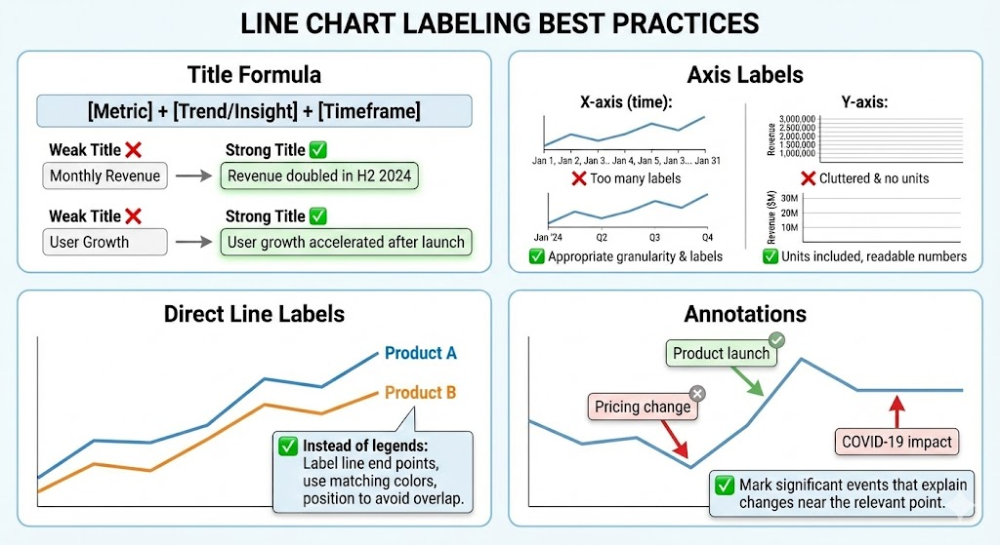

# Line Chart: The Complete Guide

**← [Back to Graphs &amp; Dashboard Design](../intro-to-graphs.md)**

The line chart is the language of trends — when you want to show how something changes over time, nothing communicates better.

<!-- Image Definitions -->

---

## History & Origin

### Playfair's Trade Lines (1786)

William Playfair created the first line charts to show England's trade balance over time. His insight: connecting points creates a visual story of change that tables cannot convey.

The line itself carries meaning its slope shows acceleration, its peaks show highs, its valleys show lows. This is **narrative encoded in geometry**.

### Why It Works

Our eyes naturally follow lines. We're wired to track motion and direction. A line chart leverages this by turning static data points into a **visual journey** through time.

---

## When to Use a Line Chart

### Perfect For:

| Question Type                  | Example                                     |
| ------------------------------ | ------------------------------------------- |
| **Trends over time**     | How has revenue grown this year?            |
| **Rate of change**       | Is growth accelerating or slowing?          |
| **Comparing trends**     | Do sales and marketing spend move together? |
| **Identifying patterns** | Is there seasonality in user signups?       |
| **Spotting anomalies**   | When did something unusual happen?          |

### Not Ideal For:

- Comparing categories at a single point (use [bar chart](./bar-chart.md))
- Part-to-whole relationships (use [pie chart](./pie-chart.md) or stacked [area chart](./area-chart.md))
- Non-continuous data (use [bar chart](./bar-chart.md))
- More than 5-7 lines (becomes spaghetti)

---

## Line Chart Variations

![Line Chart Types][line-variations]

| Type                    | Use Case               | Example                 |
| ----------------------- | ---------------------- | ----------------------- |
| **Single line**   | One metric over time   | Monthly revenue         |
| **Multi-line**    | Comparing trends       | Revenue by product line |
| **Area (filled)** | Emphasizing volume     | Total users over time   |
| **Stacked area**  | Composition over time  | Traffic by source       |
| **Sparkline**     | Inline trend indicator | Stock price in a table  |

---

## Design Principles

### 1. Time Flows Left to Right

Always place time on the x-axis, flowing from past (left) to present (right). This matches how we read and think about time.

### 2. Y-Axis Decisions

**Start at zero?** It depends:

| Situation                                 | Recommendation          |
| ----------------------------------------- | ----------------------- |
| Showing growth from nothing               | Start at zero           |
| Showing fluctuation in established metric | Can adjust range        |
| Small changes matter (stock prices)       | Adjust to show variance |

**Key rule**: Don't mislead. If adjusting the axis makes small changes look dramatic, be transparent about it.

### 3. Handling Multiple Lines

| Number of Lines | Recommendation                                      |
| --------------- | --------------------------------------------------- |
| 1-3             | Clear colors, direct labels                         |
| 4-5             | Use sparingly, highlight key lines                  |
| 6+              | Too many — filter, small multiples, or interactive |

**Tip**: Label lines directly on the chart (at the end of the line) rather than using a legend. This reduces eye movement.

### 4. Aspect Ratio Matters

The angle of lines communicates rate of change. A steep slope feels dramatic; a gentle slope feels stable.

**Rule of thumb**: The average slope should be roughly 45°. Adjust width/height to achieve this.

- Too wide = changes look flat
- Too tall = changes look extreme

### 5. Data Point Markers

| When to Show                 | When to Hide                    |
| ---------------------------- | ------------------------------- |
| Few data points (< 15)       | Many data points (continuous)   |
| Exact values matter          | Trend matters more than values  |
| Highlighting specific points | Clean, minimal design preferred |

---

## Common Issues and How to Fix Them

| Issue                                    | Problem                                                                                                                                                                                                                                                                                       | Fix                                                                                                                                                                                                                                                     |
| ---------------------------------------- | --------------------------------------------------------------------------------------------------------------------------------------------------------------------------------------------------------------------------------------------------------------------------------------------- | ------------------------------------------------------------------------------------------------------------------------------------------------------------------------------------------------------------------------------------------------------- |
| **Dual Y-Axes (The Cardinal Sin)** | Two different scales on left and right sides: You can make any two lines appear correlated · The relationship depends entirely on how you scale each axis · Readers can't accurately compare values · Example: By choosing scales, you can make sales "track" temperature, proving nothing | Use two separate charts · Normalize both to percentages · Use index (both starting at 100)                                                                                                                                                            |
| **Spaghetti Charts**               | Too many overlapping lines, impossible to read                                                                                                                                                                                                                                                | Highlight one line, gray out others · Small multiples (one chart per line) · Interactive filtering · Show only top/bottom performers                                                                                                                 |
| **Misleading Axis Truncation**     | Y-axis doesn't start at zero, making changes look larger. Example: Revenue $99M to $101M with axis from $98M to $102M looks like 100% growth                                                                                                                                                  | Either start at zero, or clearly annotate that the axis is truncated and why                                                                                                                                                                            |
| **Irregular Time Intervals**       | X-axis has inconsistent spacing (Jan, Feb, June, Dec) — the slope of the line misrepresents the rate of change                                                                                                                                                                               | Space time intervals proportionally · Clearly mark that intervals are irregular · Consider using bars for irregular data                                                                                                                              |
| **Missing Data**                   | Gaps in the data series                                                                                                                                                                                                                                                                       | Break the line (data is truly missing) · Connect anyway (gap is small, pattern matters) · Interpolate (only if valid) · Mark as estimate (if filling in, be transparent).**Never** silently interpolate if the gap might hide important events |
| **Overloaded Annotations**         | Too many labels, callouts, and annotations                                                                                                                                                                                                                                                    | Annotate only the most important events. Let the line tell most of the story                                                                                                                                                                            |

---

## Labeling Best Practices

### Title Formula

**Pattern**: [Metric] + [Trend/Insight] + [Timeframe]

| Weak Title        | Strong Title                           |
| ----------------- | -------------------------------------- |
| "Monthly Revenue" | "Revenue doubled in H2 2024"           |
| "User Growth"     | "User growth accelerated after launch" |

### Axis Labels

| Axis                    | Best Practice                                                                                                                                                                      |
| ----------------------- | ---------------------------------------------------------------------------------------------------------------------------------------------------------------------------------- |
| **X-axis (time)** | Use appropriate granularity (not all 365 days if monthly trends matter) · Label enough points for orientation, not every point · Consider: Jan '24, Feb '24... or just Q1, Q2... |
| **Y-axis**        | Include units: "Revenue ($M)" · Round to readable numbers · Remove excessive grid lines                                                                                          |

### Direct Line Labels

| Approach                     | Recommendation                                                                                          |
| ---------------------------- | ------------------------------------------------------------------------------------------------------- |
| **Instead of legends** | Label each line at its end point · Use matching colors for label and line · Position to avoid overlap |

### Annotations

Mark significant events that explain changes (e.g., "Product launch", "Pricing change", "COVID-19 impact"). Place annotations near the relevant point on the line.

---

## Quick Checklist

Before publishing a line chart:

- [ ] Time on x-axis, flowing left to right
- [ ] No dual y-axes (or very clearly justified)
- [ ] 5 or fewer lines (or filtering available)
- [ ] Lines labeled directly (not just legend)
- [ ] Appropriate aspect ratio (not too flat or steep)
- [ ] Important events annotated
- [ ] Title states the trend/insight
- [ ] Axis labels include units
- [ ] Time intervals are consistent (or clearly marked if not)

---

## Summary

The line chart tells the story of change. Respect its power:

- The slope carries meaning — don't distort it
- Multiple lines compete for attention — be selective
- Dual y-axes lie — avoid them

When showing trends, the line chart is usually right. Just keep it clean.

---

## See Also

- **[Area Chart](./area-chart.md)** — For emphasizing volume or composition over time
- **[Bar Chart](./bar-chart.md)** — For comparing categories at a single point
- **[Histogram](./histogram.md)** — For understanding the distribution of values in your data
- **[Small Multiples](../glossary.md#small-multiples)** — Alternative to overlapping lines

**Related Concepts**:

- [Data Storytelling Framework](../intro-to-graphs.md#part-8-data-storytelling-framework)
- [Dashboard Design Principles](../intro-to-graphs.md#part-7-dashboard-design-principles)
- [Common Design Mistakes](../intro-to-graphs.md#part-5-common-dashboard-design-mistakes)

[line-variations]: ../images/line-chart-variations.png
